<picture>
  <source media="(prefers-color-scheme: dark)" srcset="dark.svg">
  <source media="(prefers-color-scheme: light)" srcset="light.svg">
  
</picture>

## github stats:
 
 

## contributions

 
<!-- Snake Game Repo View -->

  

