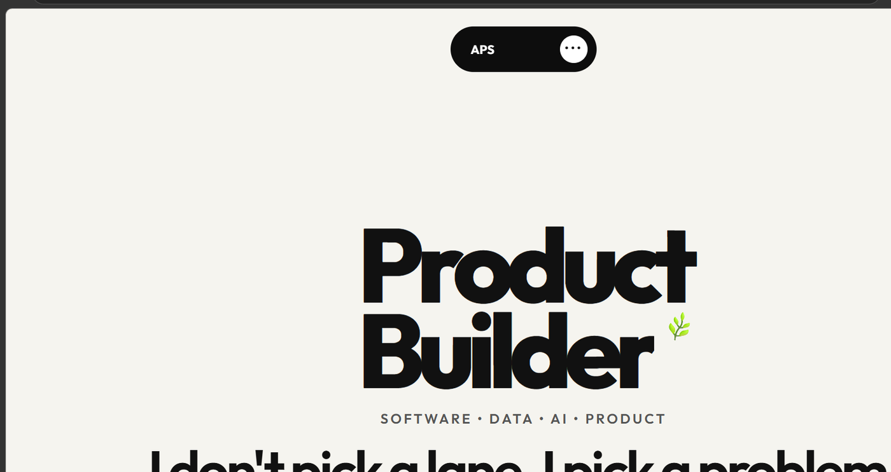
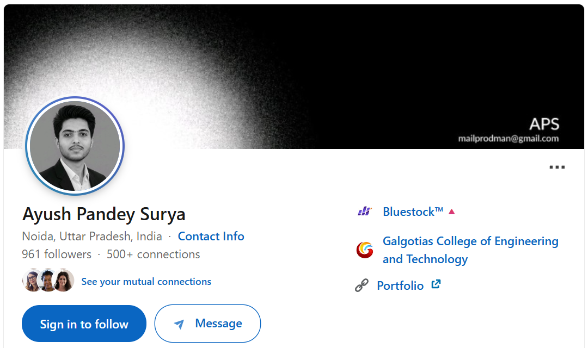

 

<a href="https://apsx.vercel.app/">portfolio</a>
&nbsp;&nbsp;·&nbsp;&nbsp;
<a href="https://www.linkedin.com/in/ayushpandeysurya/">linkedin</a>
&nbsp;&nbsp;·&nbsp;&nbsp;
<a href="https://github.com/helloayushhh">github</a>

 

### ayush pandey surya

**product-minded builder** working across **software, data, ai & product.**

i build → ship → learn → repeat.

---

### selected work

<table>
<tr>
<td width="50%" valign="top">

**investorlens**  
*ai-powered investor intelligence*

financial reports → **insights, kpis, semantic search & rag**

`python` `fastapi` `azure ai` `postgresql` `docker`

**in progress · brd / prd / trd**

</td>
<td width="50%" valign="top">

**tanu ai**  
*ai career companion*

**jobs, resumes, matching & applications** in one workspace.

`react` `typescript` `fastify` `openrouter`

**shipped · vercel / render**

</td>
</tr>

<tr>
<td width="50%" valign="top">

**swiftupi**  
*offline digital payment backend*

**bluetooth mesh + secure transaction architecture**

`java` `spring boot` `aes-256-gcm` `rsa-oaep`

**in progress · brd / prd / trd**

</td>
<td width="50%" valign="top">

**mutual fund analytics**

raw financial data → **etl, analysis & decision-ready dashboards**

`python` `sql` `power bi` `eda`

**building**

</td>
</tr>
</table>

<b>more builds</b>

`culinaryai` · `placement analytics` · `pro resume` · `go gym` · `smart logistics` · `editkaro.in` · `inventory management` · `uber fleet manager` · `meesho teardown` · `dealership lead management`

---

### how i work

**problem → product → system → build → data → iterate**

selected repositories include **brd · prd · trd · project journey**.

---

### outside github

<table>
<tr>
<td align="center" width="50%">
<a href="https://apsx.vercel.app/">

  
<b>portfolio ↗</b>
</a>
</td>
<td align="center" width="50%">
<a href="https://www.linkedin.com/in/ayushpandeysurya/">

  
<b>linkedin ↗</b>
</a>
</td>
</tr>
</table>

---

### github

  

  

  

 

**build with intent. ship with proof.**

