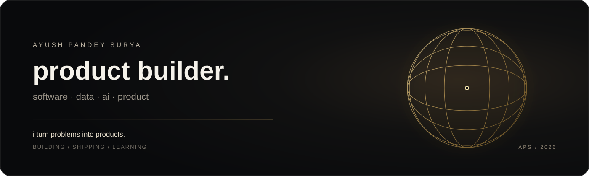

 

<a href="https://apsx.vercel.app/">portfolio</a>
&nbsp;&nbsp;·&nbsp;&nbsp;
<a href="https://www.linkedin.com/in/ayushpandeysurya/">linkedin</a>
&nbsp;&nbsp;·&nbsp;&nbsp;
<a href="https://github.com/helloayushhh">github</a>

---

### github

  

---

### contributions

---

### selected work

<table>
<tr>

<td width="50%" valign="top">

<a href="https://github.com/helloayushhh/investorlens">
<b>investorlens ↗</b>
</a>

 

*ai-powered investor intelligence*

`python` `fastapi` `azure ai` `postgresql` `docker`

**in progress · brd / prd / trd**

</td>

<td width="50%" valign="top">

<a href="https://github.com/helloayushhh/tanu-ai">
<b>tanu ai ↗</b>
</a>

 

*ai career companion*

`react` `typescript` `fastify` `openrouter`

**shipped · vercel / render**

</td>

</tr>

<tr>

<td width="50%" valign="top">

<a href="https://github.com/helloayushhh/swiftupi-repo">
<b>swiftupi ↗</b>
</a>

 

*offline upi via bluetooth mesh*

`java` `spring boot` `aes-256-gcm` `rsa-oaep`

**in progress · brd / prd / trd**

</td>

<td width="50%" valign="top">

<a href="https://github.com/helloayushhh/mutual-fund-analytics">
<b>mutual fund analytics ↗</b>
</a>

 

*financial data analytics*

`python` `sql` `power bi` `eda`

**building**

</td>

</tr>
</table>

<b>more builds</b>

 

`placement analytics` · `pro resume` · `go gym` · `smart logistics` · `editkaro.in` · `inventory management` · `uber fleet manager` · `meesho teardown` · `dealership lead management`

---

### how i work

**problem → product → system → build → data → iterate**

selected repositories include **brd · prd · trd · project journey**.

---

### outside github

&nbsp;&nbsp;

  

<a href="https://apsx.vercel.app/">portfolio ↗</a>
&nbsp;&nbsp;·&nbsp;&nbsp;
<a href="https://www.linkedin.com/in/ayushpandeysurya/">linkedin ↗</a>

---

**if you build too, say hi.**

always happy to talk shop, swap ideas, or build something useful together.

 

<a href="https://www.linkedin.com/in/ayushpandeysurya/">let's connect ↗</a>

 

**build with intent. ship with proof.**

